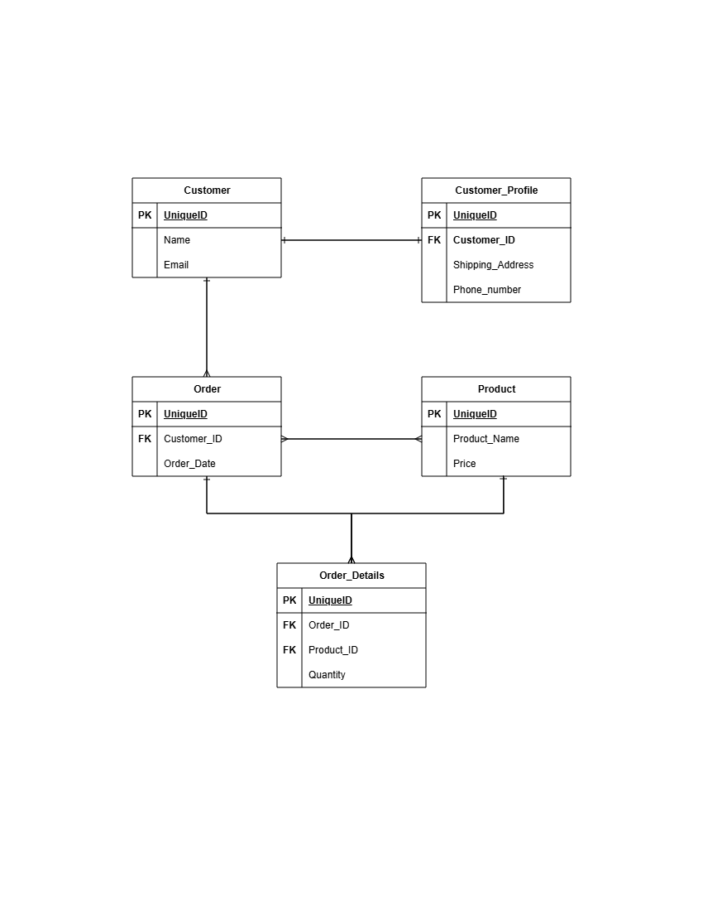

# OrderFlow — E-Commerce Order Management System

OrderFlow is a lightweight Laravel-based order and inventory management system focused on modeling Customers, Profiles, Orders, Products, and the relationships between them. The documentation below describes the database architecture and provides example Eloquent models and migration `up()` methods.

## Entity Relationship Diagram (ERD)



Text summary of relationships (at-a-glance):

- **Customer to Customer_Profile (1:1):** Each `Customer` has one `CustomerProfile`. The `customer_profiles` table stores `customer_id` as a foreign key referencing `customers.id` (cascade on delete).
- **Customer to Order (1:N):** A `Customer` can have many `Order` records. Each `orders.customer_id` references `customers.id` (cascade on delete).
- **Order to Product (M:N):** Orders and Products have a many-to-many relationship resolved via the `order_details` pivot/junction table. `order_details` stores `order_id`, `product_id` and `quantity` (pivot column).

## Laravel Models

Below are example Eloquent models for `Customer`, `CustomerProfile`, `Order`, and `Product`. They use PHP 8 attribute-style declarations for fillable/hidden (#[Fillable], #[Hidden]) as requested — note this requires either custom attribute classes or a package that maps these attributes to Eloquent behavior.

Note: `order_details` is a pivot (junction) table and does not require a dedicated Eloquent model; relationships use `belongsToMany(...)->withPivot('quantity')`.

### Customer (app/Models/Customer.php)
```php
<?php

namespace App\Models;

use Illuminate\Database\Eloquent\Model;
use Illuminate\Database\Eloquent\Relations\HasOne;
use Illuminate\Database\Eloquent\Relations\HasMany;
use App\Attributes\Fillable;
use App\Attributes\Hidden;

#[Fillable(['name', 'email'])]
#[Hidden([])]
class Customer extends Model
{
    public function profile(): HasOne
    {
        return $this->hasOne(CustomerProfile::class);
    }

    public function orders(): HasMany
    {
        return $this->hasMany(Order::class);
    }
}
```

### CustomerProfile (app/Models/CustomerProfile.php)
```php
<?php

namespace App\Models;

use Illuminate\Database\Eloquent\Model;
use Illuminate\Database\Eloquent\Relations\BelongsTo;
use App\Attributes\Fillable;
use App\Attributes\Hidden;

#[Fillable(['customer_id', 'shipping_address', 'phone_number'])]
#[Hidden([])]
class CustomerProfile extends Model
{
    public function customer(): BelongsTo
    {
        return $this->belongsTo(Customer::class);
    }
}
```

### Order (app/Models/Order.php)
```php
<?php

namespace App\Models;

use Illuminate\Database\Eloquent\Model;
use Illuminate\Database\Eloquent\Relations\BelongsTo;
use Illuminate\Database\Eloquent\Relations\BelongsToMany;
use App\Attributes\Fillable;
use App\Attributes\Hidden;

#[Fillable(['customer_id', 'order_date'])]
#[Hidden([])]
class Order extends Model
{
    public function customer(): BelongsTo
    {
        return $this->belongsTo(Customer::class);
    }

    public function products(): BelongsToMany
    {
        return $this->belongsToMany(Product::class, 'order_details', 'order_id', 'product_id')
                    ->withPivot('quantity');
    }
}
```

### Product (app/Models/Product.php)
```php
<?php

namespace App\Models;

use Illuminate\Database\Eloquent\Model;
use Illuminate\Database\Eloquent\Relations\BelongsToMany;
use App\Attributes\Fillable;
use App\Attributes\Hidden;

#[Fillable(['product_name', 'price'])]
#[Hidden([])]
class Product extends Model
{
    public function orders(): BelongsToMany
    {
        return $this->belongsToMany(Order::class, 'order_details', 'product_id', 'order_id')
                    ->withPivot('quantity');
    }
}
```

## Database Migrations (ordered `up()` methods)

Run these migrations in the order below to avoid FK constraint errors.

### 1) `customers` migration — up()
```php
public function up()
{
    Schema::create('customers', function (Blueprint $table) {
        $table->id();
        $table->string('name');
        $table->string('email');
    });
}
```

### 2) `customer_profiles` migration — up()
```php
public function up()
{
    Schema::create('customer_profiles', function (Blueprint $table) {
        $table->id();
        $table->foreignId('customer_id')->constrained('customers')->cascadeOnDelete();
        $table->string('shipping_address')->nullable();
        $table->string('phone_number')->nullable();
    });
}
```

### 3) `orders` migration — up()
```php
public function up()
{
    Schema::create('orders', function (Blueprint $table) {
        $table->id();
        $table->foreignId('customer_id')->constrained('customers')->cascadeOnDelete();
        $table->dateTime('order_date');
    });
}
```

### 4) `products` migration — up()
```php
public function up()
{
    Schema::create('products', function (Blueprint $table) {
        $table->id();
        $table->string('product_name');
        $table->decimal('price', 10, 2);
    });
}
```

### 5) `order_details` migration — up()
```php
public function up()
{
    Schema::create('order_details', function (Blueprint $table) {
        $table->id();
        $table->foreignId('order_id')->constrained('orders')->cascadeOnDelete();
        $table->foreignId('product_id')->constrained('products')->cascadeOnDelete();
        $table->unsignedInteger('quantity')->default(1);
    });
}
```

---